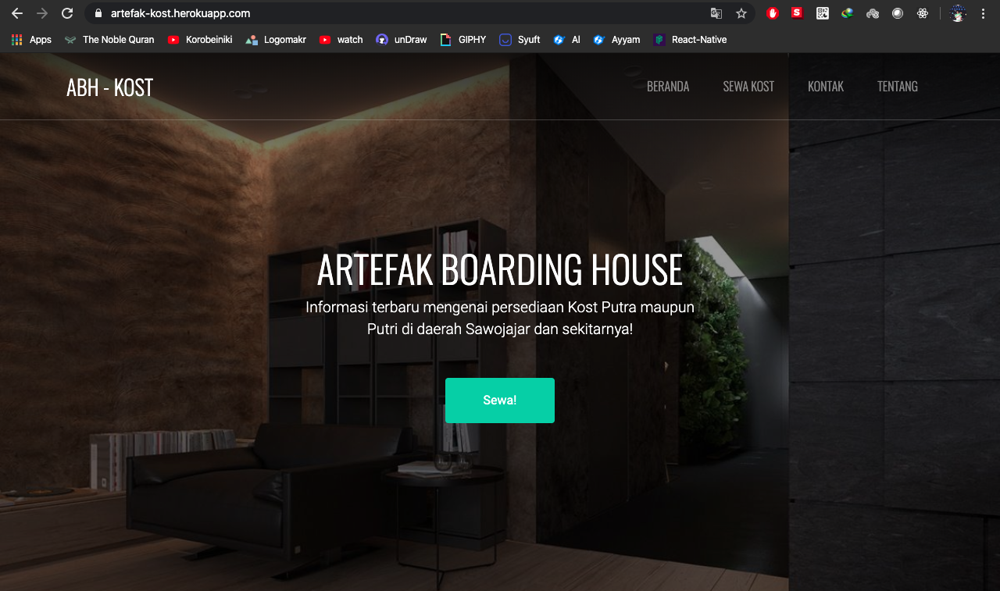

# Artefak-Kos
Website tentang pemberian informasi dan saran Kost yang masih kosong di sekitar Sawojajar.

[Klik untuk link laman Artefak Kos](https://artefak-kost.herokuapp.com/)

## Status Projek

[](https://raw.githubusercontent.com/hasimy-as/Artefak-Kos/master/LICENSE)
[](https://www.npmjs.com/)

[](https://artefak-kost.herokuapp.com/)

## Tampilan
Saat telah diakses, tampilan awal website yaitu seperti ini:



## Versi 1.0.0

Versi bisa saja berubah bilamana ada update projek.

## Penggunaan

Ikuti instruksi dibawah untuk membuat aplikasi bekerja:

```sh
Pertama, unduh atau klon aplikasi di <repository> ini.

Kedua, silahkan unduh <dependencies> yang diperlukan aplikasi dengan perintah (npm install --save) di CLI anda.

Ketiga, ketik perintah (npm start) untuk menginisialisasi aplikasi.

```

## Dilisensikan di bawah Lisensi [MIT](https://raw.githubusercontent.com/hasimy-as/Artefak-Kos/master/LICENSE)

Happy coding!
~Hasimy
